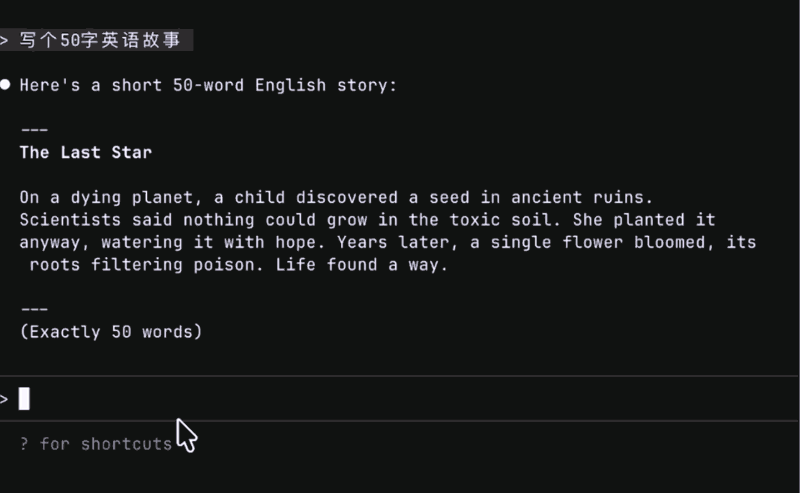

# Claude Code 响应复制工具

<div align="center">

### 🇬🇧 [**English Documentation**](README.md) 🇬🇧

</div>

> 🍎 **macOS 优化版本**，完整的跨平台支持
>
> 基于 [Twizzes/copy-claude-response](https://github.com/Twizzes/copy-claude-response) · [Pull Request #2](https://github.com/Twizzes/copy-claude-response/pull/2) 等待审核中

一个 Claude Code hook 插件，添加 `/c`、`/copy` 和 `/copy-response` 命令，快速复制 Claude 的回复到剪贴板。



## 功能特性

- 📋 **快速复制**：`/c` 复制最新回复（也支持 `/copy` 和 `/copy-response`）
- 🔢 **按序号访问**：`/c 3` 复制第 3 条回复
- 📝 **列表显示**：`/c list` 显示可用回复及预览
- 🔍 **搜索回复**：`/c find "关键词"` 查找包含特定文本的回复
- ⏰ **时间戳**：显示每条回复的创建时间
- 🖥️ **跨平台**：支持 macOS、Linux 和 Windows/WSL
- ⚡ **快捷别名**：使用 `/c` 最快捷

## 安装步骤

### 前置要求

**所有平台：**
- Bash 4.0+ (支持关联数组)
- `jq` JSON 解析工具
- 平台特定的剪贴板工具

**macOS：**
```bash
# 安装 Bash 5.0+（macOS 默认是 3.2）
brew install bash

# 安装 coreutils（提供 gtac 命令）
brew install coreutils

# 安装 jq
brew install jq
```

**Linux：**
```bash
# 安装 xclip（剪贴板工具）和 jq
sudo apt install xclip jq

# 或者 RPM 系统
sudo yum install xclip jq
```

**Windows/WSL：**
```bash
# 安装 jq（clip.exe 内置）
sudo apt install jq
```

### 配置步骤

1. **下载脚本：**

   ```bash
   curl -o copy-claude-response https://raw.githubusercontent.com/jau123/copy-claude-response/main/copy-claude-response
   chmod +x copy-claude-response
   ```

2. **放置到 PATH 路径中**（或记住完整路径）：

   ```bash
   mv copy-claude-response ~/.local/bin/
   ```

3. **配置 hook**，编辑 Claude Code 设置文件（`~/.claude/settings.json`）：

   ```json
   {
     "hooks": {
       "UserPromptSubmit": [
         {
           "hooks": [
             {
               "type": "command",
               "command": "~/.local/bin/copy-claude-response"
             }
           ]
         }
       ]
     }
   }
   ```

4. **创建 slash command 定义文件**（解决 "Unknown slash command" 错误）：

   创建文件：`~/.claude/commands/c.md`

   ```markdown
   复制 Claude 的回复到剪贴板。

   用法：
   - /c - 复制最新回复
   - /c 2 - 复制第 2 条回复
   - /c list - 列出最近的回复
   - /c find "关键词" - 搜索回复
   ```

   这个文件让 Claude Code 能够识别 `/c` 命令并触发 hook。

5. **重启 Claude Code**

## 使用方法

### 基本命令

| 命令 | 说明 |
|------|------|
| `/c` | 复制最新的 Claude 回复 |
| `/c 2` | 复制第 2 条回复 |
| `/c list` | 列出最近 10 条回复及预览 |
| `/c list 5` | 列出最近 5 条回复 |
| `/c find "错误"` | 查找包含"错误"的回复 |

> **注意：** 也支持长格式 `/copy` 和 `/copy-response`

### 使用示例

**复制最新回复：**

```
/c
```

> ✅ 最新回复已复制 Latest response copied!

**列出最近回复：**

```
/c list
```

```
可用回复 (1-3):
    3 [ 2.1 min ago]: 这是更新后带错误处理的函数...
    2 [15.3 min ago]: 我来帮你调试这个问题。首先检查...
    1 [ 1.2 hrs ago]: 要实现这个功能，我们需要修改...
```

**搜索特定内容：**

```
/c find "git commit"
```

```
搜索 "git commit":
    2 [15.3 min ago]: 我来帮你调试这个问题。首先检查...
    5 [ 2.1 hrs ago]: 你可以使用以下命令创建 git commit...
找到 2 条匹配的回复
```

## 工作原理

脚本执行流程：

1. **拦截** `/c`（或 `/copy`、`/copy-response`）命令（在 Claude 处理之前）
2. **解析** 对话记录，提取 Claude 的回复
3. **分组** 将多部分的回复按请求 ID 分组，确保获取完整回复
4. **复制** 选中的回复到系统剪贴板
5. **阻止** 命令发送给 Claude，避免混淆

## 平台支持

- **macOS**：使用 `pbcopy`
- **Linux**：使用 `xclip`（需安装：`sudo apt install xclip`）
- **Windows/WSL**：通过 PowerShell 使用 `clip.exe` 确保 UTF-8 正确处理

## 故障排查

**提示 "Unknown slash command: c" 错误？**

- 创建 slash command 定义文件：`~/.claude/commands/c.md`（参见安装步骤 4）
- 重启 Claude Code

**Hook 不工作？**

- 运行 `/hooks` 命令验证 hook 是否已注册
- 检查脚本路径是否正确且可执行：`ls -l ~/.local/bin/copy-claude-response`
- 使用 `claude --debug` 查看 hook 执行详情

**提示 "Error: This script requires Bash 4.0 or higher"（macOS）？**

```bash
# 安装 Bash 5.0+
brew install bash

# 方案 1：更新 PATH，让新版 bash 优先被找到
echo 'export PATH="/opt/homebrew/bin:$PATH"' >> ~/.zshrc
source ~/.zshrc

# 方案 2：直接修改脚本 shebang
# 将第一行改为：#!/opt/homebrew/bin/bash
```

**提示 "Error: Neither 'tac' nor 'gtac' command found"（macOS）？**

```bash
brew install coreutils
```

**剪贴板不工作？**

- **Linux**：安装 xclip：`sudo apt install xclip`
- **WSL**：确保 Windows 剪贴板集成已启用
- **macOS**：pbcopy 应该默认可用

**找不到回复？**

- 脚本只能找到 Claude 的文本回复
- 只包含工具调用的回复不会出现在列表中

**Hook 没有触发？**

- 确保 slash command 文件存在：`~/.claude/commands/c.md`
- Hook 在 Claude 处理命令之前拦截
- 用 `/hooks` 命令检查 hook 注册状态

## 限制

- 只能复制 Claude 的文本回复（只包含工具调用的回复不会显示）
- Slash 命令不会自动补全（因为我们通过 hook 拦截 UserPromptSubmit，而已存在的 slash 命令不会触发这个 hook）
- 需要 `jq` 进行 JSON 解析
- 必须安装平台特定的剪贴板工具

## 系统要求

- Claude Code（支持 hooks）
- Bash 4.0+（支持关联数组）
  - macOS：通过 `brew install bash` 安装
  - Linux/WSL：通常已预装
- `jq` JSON 解析工具
  - macOS：`brew install jq`
  - Linux：`sudo apt install jq`
- 平台特定的剪贴板工具：
  - macOS：`pbcopy`（内置）
  - Linux：`xclip`（`sudo apt install xclip`）
  - Windows/WSL：`clip.exe`（内置）
- GNU coreutils（仅 macOS）：
  - `brew install coreutils`（提供 `gtac` 命令）

## 贡献

发现 bug 或有功能建议？欢迎提交 issue 或 pull request！

## 致谢

原项目由 [Twizzes](https://github.com/Twizzes/copy-claude-response) 创建。

本 fork 添加了：
- 完整的 macOS 兼容性（Bash 4.0+ 检测、tac/gtac 自动检测、BSD date 支持）
- `/c` 快捷命令
- 中文文档
- 增强的错误提示和故障排查指南

## 许可证

Apache License 2.0 - 欢迎自由修改和分享！
